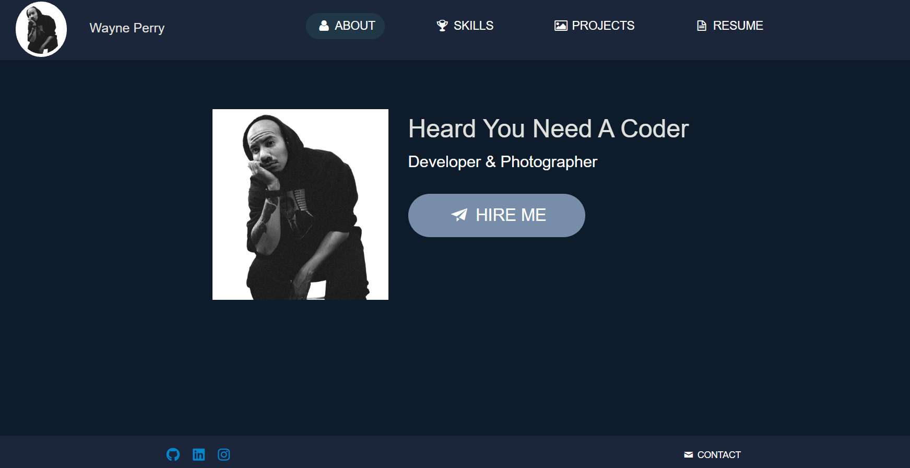

# Le Portfolio De React

## Table Of Contents

- [License](#license)
- [Description](#description)
- [Install](#install)
- [Usage](#usage)
- [Contributors](#contributors)
- [Screenshot](#screenshot)
- [Link](#link)
- [Questions](#questions)

## License: 
None

## Description
For this project we had to create a new portoflio using react, we needed to create differnt components and render them using react. For this assignment I decided to refactor my original portfolio and update it using react so it had a more dynamic structure to it

## Install
In order to install this repo you need to copy the SSH key then in the terminal do a simple git clone followed by pasting the SSH key, afterwards you need to do an npm i in order to install the dependecies 

## Usage
The usage for this project is to show my bootcamp I'm able to comprehend and use react, it also to show future employers my skills and capabilites

## Contributors
If you wish to contribute and help me make this portfolio better you can either email me or message me directly here on github

## Screenshot

## Link
https://dazzling-croquembouche-dcbdb7.netlify.app/

## Questions
If you have any questions contact me at perrwayne39@gmail.com or you can reach me at www.github.com/TheQuestioningCake
